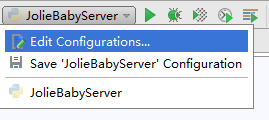
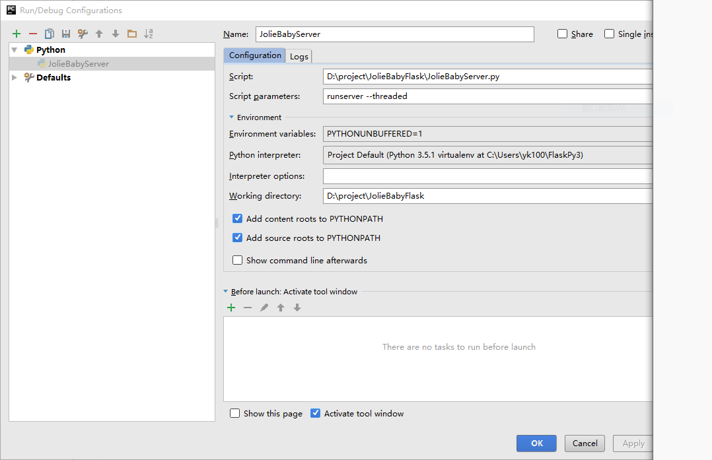

# flask-server

使用flask开发整套服务

## 初始化虚拟环境

安装命令: ` pip install pipenv `

**创建环境**: `pipenv --three`

其他命令:

```python
pipenv --three   会使用当前系统的Python3创建环境
pipenv --python 3.6 指定某一Python版本创建环境
pipenv shell 激活虚拟环境
pipenv --where  显示目录信息
pipenv --venv  显示虚拟环境信息
pipenv --py  显示Python解释器信息
pipenv install requests 安装相关模块并加入到Pipfile
pipenv install django==1.11 安装固定版本模块并加入到Pipfile
pipenv graph 查看目前安装的库及其依赖
```

**PyCharm指定虚拟环境**:

1. File->Settings-Project:flask-server->Project Interpreter
2. 选择Show All
3. 点击加号->选择Add Local
4. 选择Existing environment
5. 执行pipenv --venv查看虚拟环境地址并找到`\Scripts\python.exe`
6. 依次点击OK完成


## 使用flask-script启动服务:

`python manage.py runserver -h 127.0.0.1 -p 8090`

## 数据库创建

manage.py添加app,db,model到shell上下文:

```python
def make_shell_context():
    return dict(app=app, db=db, DateModel=DateModel)


manager.add_command("shell", Shell(make_context=make_shell_context))
```


## 使用@manager.command自定义命令 

创建命令:

```python
@manager.command
def create_data():
    print("create_data start")
    all_date_list = getAllDayPerYear("2020")
    for date in all_date_list:
        print('插入 : ', date)
        now_date = datetime.datetime.strptime(date,"%Y-%m-%d")
        if now_date.weekday() == 5 or now_date.weekday() == 6:
            db.session.add(DateModel(now_date, False))
        else:
            db.session.add(DateModel(now_date, True))
        db.session.commit()
    print("create_data end")
```


执行命令: `python manage.py create_data`

## flask-restful flasgger API-文档

*主要记录flasgger的安装及基本使用过程:*

**安装flasgger**
```python
pip install flasgger
```

**初始化flasgger**
```python
from flasgger import Swagger

swagger = Swagger()

def init_swagger_plugin(app):    
    swagger.init_app(app)

def create_app(config_name):
    app = Flask(__name__)
    init_swagger_plugin(app)
    return app
```

**配置flasgger参数**
```python
SWAGGER = {    'title': 'ShortUrl API',    'uiversion': 3}
```

**配置接口描述yml文件**
*get接口*
```yml
通过id获取长连接
---
parameters:
  - name: id
    in: '使用长连接生成的id'
    type: string
    required: true
    enum: ['csdisjzaf']
    default: 'csdisjzaf'
responses:
  200:
    description: '查询成功后返回id指定的长连接'
    schema:
      $ref: '#/definitions/ShortUrlGetResp'
    examples:
      data: 'https://blog.csdn.net/lanyang123456/article/details/80717250'
definitions:
  ShortUrlGetResp:
    type: object
    properties:
      data:
        type: string
```
*post接口*
```yml
根据传入的长连接生成短连接
---
parameters:
  - name: source
    in: '使用长连接生成的id'
    type: string
    required: true
    enum: '{"source":"https://blog.csdn.net/lanyang123456/article/details/80717250"}'
    default: '{"source":"https://blog.csdn.net/lanyang123456/article/details/80717250"}'
responses:
  200:
    description: '返回生成的短连接'
    schema:
      $ref: '#/definitions/ShortUrlPostResp'
    examples:
      data: '{"short": "http://localhost:5000/surl/csdisjzaf"}'
definitions:
  ShortUrlPostResp:
    type: object
    properties:
      short:
        type: string
```

**改造flask_restful->Resource**
*指定函数配置接口yml文件*
```python
class ShortUrl(Resource):

    @swag_from('short_url_get.yml')
    def get(self, id):
    
    @swag_from('short_url_post.yml')
    def post(self):

```

**访问预览**
```
http://localhost:5000/apidocs/#/
```

**问题解决**
如果你在使用flask-restful有以下形式的配置,可能生成的接口文档每个接口会生成按多个路由生成多份
```
api.add_resource(ShortUrl, '/surl', '/surl/<id>')
```
要解决这个现象,请进行以下配置:
1. 拆分resource,指明endpoint
```python
api.add_resource(ShortUrl, '/surl', endpoint="surl_post")
api.add_resource(ShortUrl, '/surl/<id>', endpoint="surl_get")
```
2. 为swag_from增加endpoint配置
```python
@swag_from('short_url_get.yml', endpoint='surl_get')

@swag_from('short_url_post.yml', endpoint='surl_post')
```

## 应用flasgger实现swagger文档查看

` http://127.0.0.1:9999/apidocs/ `

## PyCharm配置使用Flask-Script启动以及开启Debug模式

####  配置PyCharm中的启动参数

1. 点击“Edit Configuartions” 

   

2. 对运行时和运行环境做相关配置 

   

####  开启Debug模式 

```python
from flask.ext.script import Manager, Server
 
app = Flask(__name__)
manager = Manager(app)
manager.add_command("runserver", Server(use_debugger=True))
 
 
if __name__ == "__main__":
    manager.run()
```

